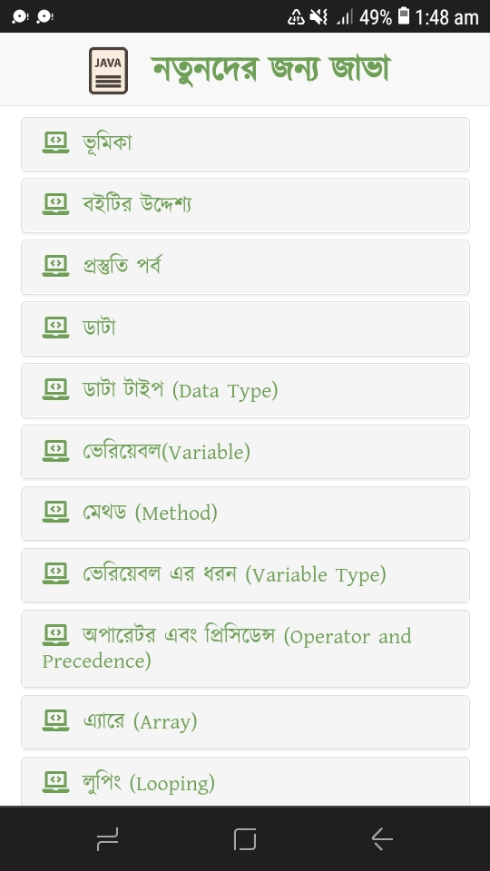

# [Java For Newbies](https://mdnaimur0.github.io/java-for-newbies/)

This is an excellent start for those who want to learn Java in Bengali. [Nazmul Hasan Nero](https://github.com/cknazmul) described every topic sub labially with examples that will make everyone clear about the basics of Java.

**You will find this repository as readable here:** [mdnaimur0.github.io/java-for-newbies](https://mdnaimur0.github.io/java-for-newbies/)

Credit-  
[Nazmul Hasan Nero](https://github.com/cknazmul)  
Software Product Manager, Scrum Master, Writer  
[nhnero.info](https://nhnero.info/)

## Screenshots
  
